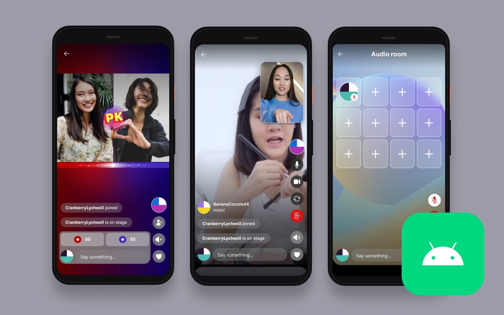

# Amazon IVS Real-time for Android Demo

A demo Android application in Kotlin intended as an educational tool to demonstrate how you can build a feed of real-time streams and audio rooms with [Amazon IVS](https://www.ivs.rocks/).

**This project is intended for education purposes only and not for production usage.**

## Prerequisites

You must deploy the [Amazon IVS Real-time Serverless Demo](https://github.com/aws-samples/amazon-ivs-real-time-serverless-demo). After deploying the serverless demo, note the outputs: `QR code`, `Customer ID` and `API key`.

## Setup

1. Clone the repository to your local machine.
2. Open the repository in [Android Studio](https://developer.android.com/studio), or an IDE of your choice.
3. Run the application on an emulated device or a physical device running API level 33 or later.
4. When prompted, scan the `QR code` from the [Amazon IVS Real-time Serverless Demo](https://github.com/aws-samples/amazon-ivs-real-time-serverless-demo).

- If you are unable to scan the QR code, paste the combined `Customer ID` and `API key` in this format: `{Customer ID}-{API key}` when prompted in the app. For example: `a1bcde23456f7g-abcDeFghIQaTbTxd0T95`

**IMPORTANT NOTE:** Joining a stage in the app will create and consume AWS resources, which will cost money.

## Known Issues

- This app has only been tested on devices running Android 13 and API level 33 or later. While this app may work on older versions of Android, they have not been extensively tested.
- A list of known issues for the Amazon IVS Broadcast SDK is available on the following page: [Amazon IVS Broadcast SDK: Android Guide](https://docs.aws.amazon.com/ivs/latest/userguide/broadcast-android-issues.html)

## More Documentation

- [Amazon IVS Android Broadcast SDK Guide](https://docs.aws.amazon.com/ivs/latest/userguide/broadcast-android.html)
- [Amazon IVS Android Broadcast SDK Sample code](https://github.com/aws-samples/amazon-ivs-broadcast-android-sample)
- [More code samples and demos](https://www.ivs.rocks/examples)

## License

This project is licensed under the MIT-0 License. See the LICENSE file.
